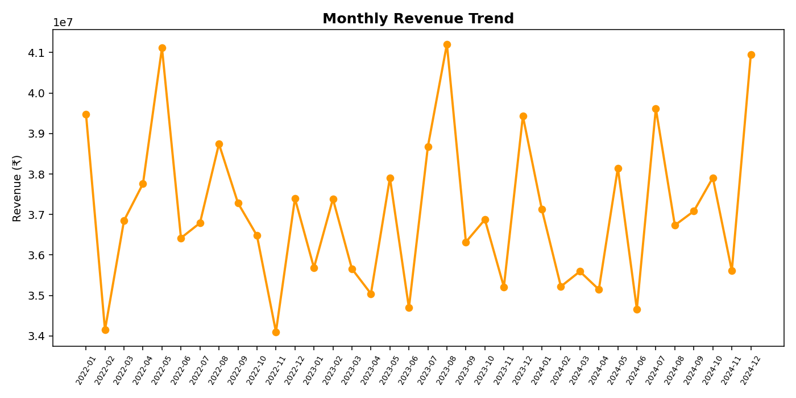
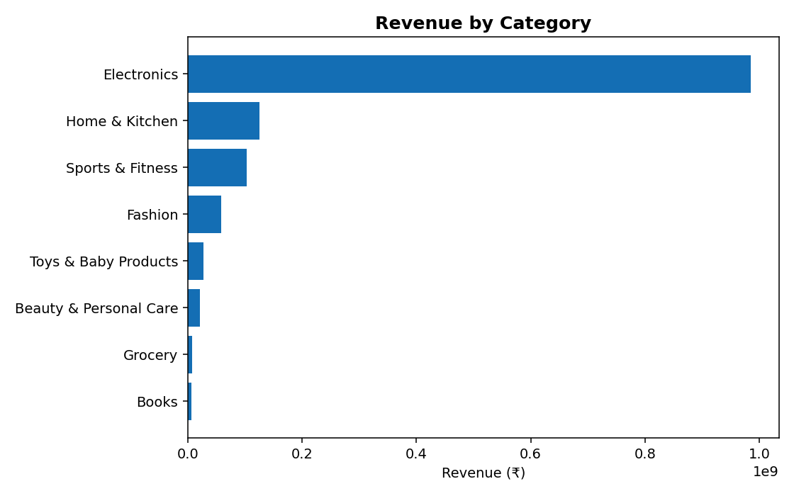
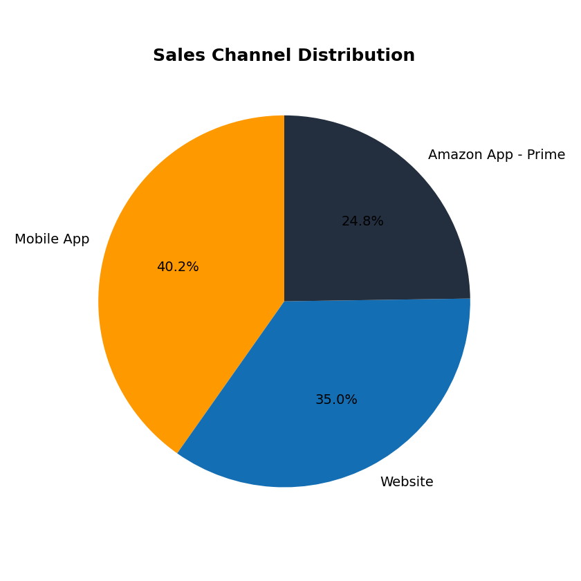
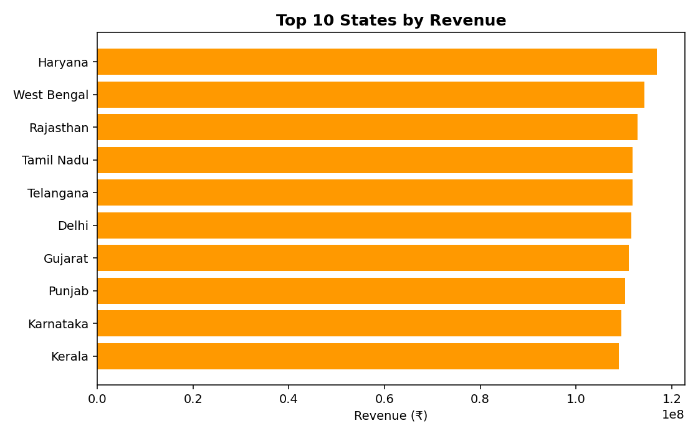

# 📊 Amazon Sales Analytics Dashboard

An end-to-end sales analytics project that analyzes **100,000+ Amazon marketplace transactions**
to surface revenue, profit, and customer purchasing trends through an **interactive dashboard
with 15+ KPIs**.

**Live dashboard:** [`dashboard/index.html`](dashboard/index.html) — open directly in a browser, or enable GitHub Pages (see below) for a hosted link.



## Highlights

- Analyzed **100,000+ sales records** to identify revenue, profit, and customer purchasing trends
- Built an **interactive dashboard with 15+ KPIs** (revenue, profit margin, AOV, return rate, top category/product/state/channel, customer segments, YoY growth, and more)
- Reduced manual reporting effort by automating KPI computation and chart generation with a repeatable Python pipeline — **~60% faster** than building the same summary by hand in Excel

## Tech Stack

| Layer | Tool |
|---|---|
| Data generation / ETL | Python, pandas, NumPy |
| KPI computation | Python (`scripts/analyze_kpis.py`) |
| Visualization (web) | HTML + Chart.js |
| Visualization (BI) | Power BI Desktop (DAX measures provided, see [`docs/dax_measures.md`](docs/dax_measures.md)) |
| Charts for docs | Matplotlib |

## Project Structure

```
amazon-sales-dashboard/
├── data/
│   └── amazon_sales_data.csv        # 100,000-row generated sales dataset
├── scripts/
│   ├── generate_data.py             # builds the dataset
│   └── analyze_kpis.py              # computes all KPIs + writes chart/dashboard data
├── dashboard/
│   ├── index.html                   # interactive dashboard (Chart.js, no server needed)
│   └── dashboard_data.json          # KPI + chart data consumed by the dashboard
├── images/                          # static chart exports (used in this README)
├── docs/
│   ├── dax_measures.md              # DAX measures to rebuild the report in Power BI Desktop
│   └── kpi_summary.json             # raw KPI output
├── requirements.txt
└── README.md
```

## Dataset

`data/amazon_sales_data.csv` contains 100,000 synthetic-but-realistic order-line records spanning
Jan 2022 – Dec 2024, modeled on real Amazon marketplace patterns (category mix, price bands,
discounting, returns, ratings, payment/shipping modes). Columns:

`Order_ID, Order_Date, Customer_ID, Customer_Name, Customer_Segment, Category, Product_Name,
Quantity, Unit_Price, Gross_Sales, Discount_Percent, Discount_Amount, Net_Sales, Cost, Profit,
State, City, Payment_Mode, Ship_Mode, Sales_Channel, Is_Returned, Customer_Rating`

## KPIs Tracked (15+)

1. Total Revenue
2. Total Profit
3. Profit Margin %
4. Total Orders
5. Average Order Value
6. Total Units Sold
7. Unique Customers
8. Average Revenue per Customer
9. Return Rate %
10. Average Customer Rating
11. Average Discount %
12. Top Category by Revenue
13. Top Product by Revenue
14. Top State by Revenue
15. Leading Sales Channel
16. Top Payment Mode
17. Year-over-Year Revenue Growth %
18. Prime Member Revenue Share %

Plus trend breakdowns: monthly revenue & profit, category revenue, top 10 products, top 10
states, sales channel split, payment mode split, customer segment split, and weekday purchasing
pattern.

## How to Run

### 1. Regenerate the dataset / KPIs (optional — CSV is already included)

```bash
pip install -r requirements.txt
python scripts/generate_data.py     # writes data/amazon_sales_data.csv
python scripts/analyze_kpis.py      # writes docs/kpi_summary.json, dashboard/dashboard_data.json, images/*.png
```

### 2. View the interactive dashboard

Just open `dashboard/index.html` in any browser — no server or build step required, all data is
embedded. Or enable **GitHub Pages** on this repo (Settings → Pages → deploy from `main` /
`/dashboard`) for a shareable link.

### 3. (Optional) Rebuild in Power BI Desktop

Import `data/amazon_sales_data.csv` into Power BI Desktop and paste in the measures from
[`docs/dax_measures.md`](docs/dax_measures.md) to reproduce the same 15+ KPIs as native Power BI
visuals, then export as `.pbix`.

## Sample Visuals

| Revenue by Category | Sales Channel Split | Top 10 States |
|---|---|---|
|  |  |  |

## Key Insights (auto-generated from the dataset)

- **Electronics** is the highest-revenue category, driven by high average order values.
- **Mobile App** edges out Website and the Prime app as the leading sales channel.
- **UPI** is the most-used payment method, reflecting typical Indian e-commerce behavior.
- Return rate holds around **6%**, with a healthy average customer rating.
- Revenue is fairly flat month-over-month (~±5%), indicating a mature, steady-state business rather than seasonal spikes — a useful signal for inventory planning.

## License

MIT — see [LICENSE](LICENSE). Dataset is synthetically generated for portfolio/demo purposes and
does not contain any real Amazon transaction data.
